# skillsentry — the guide

This is the **how and why** of skillsentry: not a feature tour, but an explanation of what agent-skill
supply-chain attacks are, how a static auditor catches them without ever running them, and how the pieces
fit together. It's written for people who want to *understand* the tool — to trust it, extend it, or learn
from it — not just run it.

skillsentry is a FOSS tool built because the thing should exist. The docs are in the same spirit: they
teach the design, including its limits.

## Start here

| If you want to… | Read |
|---|---|
| Understand the threat skills pose, and how to read a verdict | [Threat model & reading a report](./threat-model.md) |
| See how the scanner is built and why "never execute" is structural | [Architecture](./architecture.md) |
| Learn what each detector actually looks for (and what it misses) | [How detection works](./how-detection-works.md) |
| Look up a term (taint, tier, capability fingerprint, EARS…) | [Glossary](./glossary.md) |
| Add a detection rule | [Ruleset contributor guide](../RULESET.md) |
| See the decisions behind the design | the [ADRs](../architecture/) |

## A one-paragraph picture

You point skillsentry at a skill — a local folder, or a git URL it clones **read-only, with every hook
disabled**. It enumerates the files, runs a ruleset over them (fast pattern rules, plus deterministic
dataflow analysis of bundled shell scripts), and aggregates the findings into a single **PASS / REVIEW /
BLOCK** verdict where every finding cites a `file:line`, a reason, and a framework ID (OWASP / MITRE
ATLAS). It never executes, never phones home, and has zero runtime dependencies of its own.

Each stage is explained in [Architecture](./architecture.md); each detector in
[How detection works](./how-detection-works.md).
