# Architecture

How skillsentry is put together, and why it's shaped this way. The guiding constraint is simple and
absolute: **the auditor must never execute, fetch, or be influenced by the thing it audits.** Everything
below follows from taking that seriously.

> The authoritative decisions live in the [ADRs](../architecture/). This guide is the map; the ADRs are
> the territory.

## The pipeline

An audit is a straight line from a target to a verdict. No stage runs audited code; each stage hands the
next a plain in-memory value.

  

1. **Resolve & acquire** (`src/adapters/acquire.ts`). The target is either a local directory (read in
   place) or a git URL. For a URL, skillsentry does a shallow, **read-only** clone: `--depth 1
   --no-checkout`, git hooks disabled (`core.hooksPath=/dev/null`), submodules off, LFS smudge skipped.
   Nothing in the repository is allowed to run. The result is a temp path plus a cleanup function.
2. **Enumerate & classify** (`enumerate.ts`, `classify.ts`). The tree is walked into a list of
   `FileRecord { path, content, kind }`, where `kind` tags a file structurally (`skill`, `hook`, `script`,
   `mcp-config`, `plugin-manifest`, …) so rules can scope themselves.
3. **Apply `.skillsentryignore`** (`ignore.ts`). Optional gitignore-style excludes. Crucially, **every
   exclusion is counted and disclosed** — an ignore file can narrow a scan but can never silently bury a
   finding.
4. **Scan** (`engine.ts`). The ruleset runs over the files, producing `Finding`s. See
   [How detection works](./how-detection-works.md).
5. **Drift (T3), if a baseline exists** (`drift.ts`). When a `.skillsentry.lock` is present, a temporal
   pass diffs the current scan against the approved baseline. Covered in
   [How detection works → Rug-pull detection](./how-detection-works.md#tier-t3--rug-pull--version-drift).
6. **Aggregate** (`verdict.ts`). Findings collapse to the single highest severity → PASS / REVIEW / BLOCK.
7. **Report** (`report.ts`). Markdown + JSON, with optional `--badge` and `--ci` lines.

## The boundary that makes "never execute" structural

"Never execute" isn't a runtime check you can forget to call — it's enforced by **where code is allowed to
live**. The codebase is split into three layers, and the dependency rule between them is the whole game.

  

- **Pure core** (`src/core/*`) — the engine, the rules, the matchers, verdict, drift, lock, report. It
  imports `node:*` **nothing**: no `fs`, no `child_process`, no `crypto`, no network. It only ever sees
  in-memory `FileRecord`s and returns plain data. A pure function can't shell out, so it can't be tricked
  into running a payload.
- **Adapters** (`src/adapters/*`) — the *only* code that touches the outside world: cloning, reading
  files, hashing, reading/writing the lockfile. I/O is quarantined here.
- **CLI** (`src/cli.ts`, `bin.ts`) — wires adapters to the core, formats output, sets the exit code.

This is the [hexagonal / ports-and-adapters](../architecture/) shape, and it is enforced by a test
(`src/core/__tests__/layering.test.ts`) that scans every core source and **fails the build** if one
imports a `node:` builtin. The guarantee is mechanical, not aspirational. (See ADR-001.)

A second consequence: audited content — and even the detection rules — is treated as **data, never code**.
There is no `eval`, no `Function`, no dynamic `import`, no shell anywhere in the loading path. A hostile
`SKILL.md` or a malicious rule pattern is, at worst, a string that fails to match.

## Zero dependencies, on purpose

`package.json` has `dependencies: {}`. A tool whose job is to audit *your* supply chain having a supply
chain of its own would be self-defeating: every transitive package is attack surface and a reason to
distrust the verdict. Everything skillsentry needs is the Node standard library. (The diagram renderer
`mmdc` is maintainer-only tooling and ships to nobody.)

## Determinism & offline

Same input → same verdict, every time. No clocks, no randomness, no network in the scan path, no model in
the loop. This is what lets the trust badge and the approval lockfile be **byte-stable**, and it's why a
verdict is reproducible by anyone, anywhere, including in air-gapped CI.

## Where to read next

- [How detection works](./how-detection-works.md) — the tiers and every detector.
- [Threat model & reading a report](./threat-model.md) — what this does and doesn't protect against.
- [ADR-001](../architecture/) and onward — the recorded rationale for each decision.
