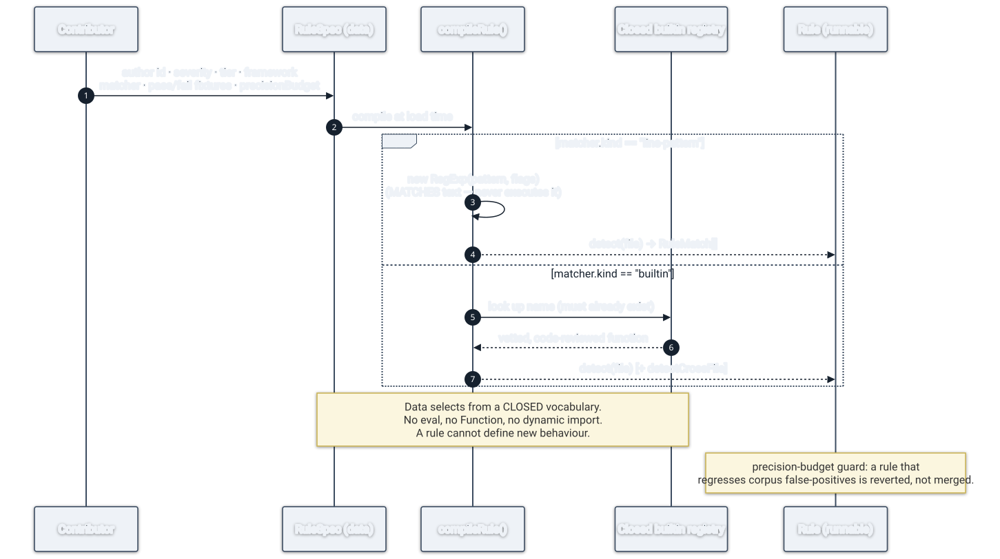

# How detection works

What skillsentry actually looks for — and, just as importantly, what each detector **deliberately does
not** catch. Honesty about limits is part of being trustworthy: a scanner that implies it catches
everything teaches you to stop thinking.

Every finding carries a **tier** (how it was found), a **severity** (low / medium / high), and a
**framework mapping** (an OWASP and a MITRE ATLAS id) so it lands in the vocabulary security teams already
use.

## The tiers

Detection is layered. Everything that is on by default stays **deterministic, offline, and
never-executing** — those properties are non-negotiable, so any technique that would break them (an LLM
judge, say) is reserved as a future *opt-in* tier, never a default.

<p align="center">
  
</p>

- **T0 — pattern.** Per-file, mostly single-line. Regular expressions plus a closed set of vetted
  structural matchers (for things a regex can't express cleanly — unicode tricks, JSON scope analysis).
- **T1 — dataflow / taint.** Multi-line analysis of bundled shell scripts: does untrusted data *flow* into
  a dangerous operation, even when it's spread across several lines or files?
- **T3 — temporal / rug-pull.** Not a per-file rule at all: it compares the skill against a previously
  *approved* baseline and flags capability that has **grown since you trusted it**.

(There is no T2. The number is reserved for a possible future semantic tier; it is intentionally unbuilt
because it would break the offline/deterministic guarantee. See the [glossary](./glossary.md) and ADR-008.)

## Tier T0 — the pattern detectors

Five detection classes operate on the skill's own files. Each rule is declarative data with its own
fixtures and a precision budget (see [How a rule works](#how-a-rule-becomes-a-matcher)).

### `dangerous-bash` — execution & exfiltration
Catches shell that pipes the network into an interpreter or reads secrets out.
Rules: `curl-pipe-to-shell` (`curl … | sh` — classic install-time RCE), `reverse-shell-dev-tcp`
(`/dev/tcp` reverse shells), `secret-path-read` (reads of `~/.aws`, `~/.ssh`, etc.), `base64-piped-payload`
(decode-and-run). **Misses:** heavy obfuscation that hides the sink on one line — that's what T1 is for.

### `prompt-injection` — coercing the agent
Hidden or coercive instructions aimed at the model reading the file.
Rules: `ignore-previous-instructions`, `tool-coercion-exfiltration`, `zero-width-unicode` (invisible
characters), `html-comment-instruction` (directives in `<!-- -->`), `homoglyph-override` (look-alike
characters), `encoded-override-payload` (base64/hex), `ansi-line-jumping` (ANSI escapes that rewrite the
terminal view). **Misses:** novel natural-language phrasings that no pattern anticipates — detection here
is a moving target, which is exactly why the ruleset is contributable.

### `over-broad-perms` — privilege the skill shouldn't need
Rules: `bash-allow-all` (`"Bash(*)"`), `hook-network-command` (hooks that reach the network),
`mcp-combined-scopes` (one MCP server fusing filesystem + network + secrets). **Misses:** permissions that
are individually reasonable but dangerous in combination beyond the modelled scopes — judgement still
matters.

### `committed-secrets` — credentials shipped in the skill
Rules: `aws-access-key`, `github-token`, `private-key-block`. Format- and prefix-based. **Misses:**
high-entropy secrets with no recognisable format, and secrets in git history rather than the working tree.

### `tool-description-poisoning` — the part you never read
Malicious instructions hidden in tool/skill **descriptions** the model ingests but the human reviewer
doesn't see in normal use. Rules: `frontmatter-description` (skill YAML), `mcp-tool-description` (MCP tool
objects). This class exists because the dangerous text often isn't in the body at all.

## Tier T1 — dataflow / taint

A single-line regex can't see a payload assembled in pieces:

```sh
URL=$(get_secret)          # tainted: comes from a sensitive source
PAYLOAD=$(curl "$URL")     # still tainted: fetched using a tainted value
echo "$PAYLOAD" | sh       # SINK: tainted data piped into a shell
```

T1 reads bundled shell scripts and tracks **taint** — untrusted data — from a SOURCE, through variable
assignments, to a dangerous SINK, across lines and (via `source`) across files. It runs in pure string
space: tokenizing, never executing, never fetching.

<p align="center">
  
</p>

- **Sources:** command substitution `$(…)`, network fetch (`curl`/`wget`), base64/hex decode, sensitive
  env vars, `read` from stdin.
- **Propagation:** an assignment whose right-hand side uses a tainted variable becomes tainted (one
  forward pass, top to bottom).
- **Cross-file:** a literal `source ./lib.sh` is resolved **in memory and path-safely** — never fetched,
  never run — and tainted variables flow in from the sibling. An include that escapes the target root is
  itself flagged. (ADR-006, ADR-007.)
- **Sinks:** pipe to `sh`/`bash`/`zsh`, `eval`/`exec`, `source` of a tainted target, or a tainted write to
  an autorun location (`.bashrc`, `crontab`, systemd unit, `authorized_keys`).

Rules: `dataflow-taint/shell-source-to-sink` (intra-file), `dataflow-taint/shell-crossfile-source-to-sink`
(cross-file). **Misses (recorded honestly in ADR-007):** taint through shell *function parameters*, and
any language other than shell — JS/TS dataflow would need a parser, which would mean a dependency, so it's
deferred to a possible future opt-in tier.

## Tier T3 — rug-pull / version drift

The rug-pull is the attack a stateless scanner cannot see: a skill that was clean when you approved it and
has since mutated to gain dangerous capability. T3 closes that gap.

You record a baseline with `skillsentry <target> --approve`, which writes a `.skillsentry.lock` capturing
the skill's **capability fingerprint** (its findings + permissions + scripts + hooks, plus a per-file
hash). On later runs, if the lockfile is present, skillsentry diffs the current scan against it.

<p align="center">
  
</p>

- **Escalation** — a capability present now that wasn't approved (a new sink, permission, or hook). This is
  the rug-pull signal.
- **Approval invalidation** — an approved file's bytes changed while a finding it carried is still present:
  the approval no longer covers what's on disk.
- **Benign drift** — bytes changed but the capability set is identical (a doc edit, a version bump, a
  reorder). This is **not** a finding — it's an informational note. Keying the diff on *capabilities*
  rather than raw hashes is what keeps benign edits from becoming false positives.

Two load-bearing properties (ADR-008):

- **Additive-only.** The verdict is `aggregate(fresh ∪ drift)`. The lockfile can only *add* findings, never
  remove one — the fresh scan always runs and sets the floor.
- **No laundering.** Because of additive-only, a permissive lockfile can't suppress a real BLOCK; and any
  high-severity finding the lockfile *pre-approved* is **disclosed** in the report. A baseline that blessed
  something dangerous is surfaced, not trusted blindly.

## How a rule becomes a matcher

Rules are **data, not code** — which is why a contributor can add one safely and why a malicious rule
pattern can't execute.

<p align="center">
  
</p>

A `RuleSpec` declares an id, severity, tier, framework mapping, a matcher, pass/fail fixtures, and a
precision budget. At load time it compiles to a runnable matcher: a `line-pattern` becomes a `RegExp`
(which *matches* text, never runs it); a `builtin` selects a vetted function from a **closed registry** (a
rule cannot invent new behaviour). A rule that pushes the corpus false-positive rate over its budget is
reverted, not merged — **precision is the bar**. Full workflow in the [ruleset guide](../RULESET.md).

## Reading the result

See [Threat model & reading a report](./threat-model.md#reading-a-report) for what PASS / REVIEW / BLOCK
mean, how severity maps to the verdict, and when to act.
