# Threat model & reading a report

What skillsentry defends against, what it deliberately doesn't, and how to act on a verdict. A security
tool earns trust by being precise about its own scope — so this page draws the boundary honestly.

## Agent-skill supply-chain attacks, briefly

An **agent skill** (or plugin) is executable markdown plus scripts, hooks, and tool/MCP configuration. When
you install one, it runs with **your shell's full authority** — your files, your credentials, your network.
The bar to publish is low: a `SKILL.md` and an account. There's no mandatory review, no signing, no sandbox
by default.

That makes skills a supply-chain target, in the same family as malicious npm/PyPI packages but with some
twists specific to agents:

- **Install-time RCE.** A hook or bundled script that fetches and runs code (`curl … | sh`) the moment the
  skill is set up.
- **Prompt injection.** Instructions aimed at the *model*, not the human — hidden in invisible unicode,
  HTML comments, encoded blobs, or in tool **descriptions** the user never reads — that coerce the agent
  into exfiltrating data or misusing tools.
- **Over-broad permissions.** Allow-all shell, or one MCP server that fuses filesystem + network + secrets,
  so a single compromise is total.
- **Committed secrets.** Credentials shipped inside the skill, leaking the author's (or others') access.
- **The rug-pull.** A skill that is clean when you review it and mutates *after* you've approved it —
  exploiting the fact that almost nobody re-audits an update.

These map to recognised frameworks — the [OWASP Agentic Security Initiative / Top 10s](https://owasp.org/)
and [MITRE ATLAS](https://atlas.mitre.org/) — and every skillsentry finding cites the relevant IDs so it
connects to how your security team already tracks risk. The detectors for each are described in
[How detection works](./how-detection-works.md).

## What skillsentry protects against

- Static, detectable instances of the five content classes above (dangerous bash, prompt injection,
  over-broad perms, committed secrets, description poisoning) — **tier T0**.
- Multi-line / cross-file shell payloads that single-line patterns miss — **tier T1** dataflow/taint.
- Post-approval capability growth — **tier T3** rug-pull detection, when you've recorded a
  `.skillsentry.lock` baseline.

…all **without executing the skill**, offline, deterministically, with every finding explained.

## What it does NOT protect against

Being clear here is the point.

- **It is not a sandbox or a runtime guard.** It tells you whether to trust a skill *before* you run it. It
  does nothing once the skill is running.
- **It doesn't prove safety.** PASS means "no rule matched," not "this is safe." Novel attacks, clever
  natural-language injection, and obfuscation beyond the modelled tiers can pass. Absence of evidence isn't
  evidence of absence.
- **Language coverage is partial.** T1 dataflow covers shell. JavaScript/TypeScript interprocedural taint
  would require a parser (a dependency) and is deliberately deferred (ADR-006/007).
- **Secrets detection is format-based** and scans the working tree, not git history.
- **It trusts your inputs about scope.** A `.skillsentryignore` can narrow the scan — but it can never do so
  *silently*; every exclusion is disclosed (see below).
- **It audits skillsentry's own threat model, not the wider system.** It won't catch a compromised model,
  a malicious MCP *server* you connect to at runtime, or social-engineering outside the skill's files.

Treat a PASS as "no known-bad patterns found," one input to your judgement — not a guarantee.

## Reading a report

Findings collapse to a single verdict: the **highest severity** present wins.



| Verdict | Meaning | Exit code | What to do |
|---|---|---|---|
| **PASS** ✅ | No findings. | `0` | Reasonable to proceed; still apply judgement. Badge-eligible. |
| **REVIEW** ⚠️ | Highest finding is low or medium. | `0` | Read the findings. Often legitimate-but-noteworthy; decide per item. |
| **BLOCK** ⛔ | At least one high-severity finding. | `1` | Don't install as-is. The exit code gates CI. |

Only **BLOCK** is non-zero, so it drops into CI without failing builds on advisory findings. Each finding
gives you everything needed to judge it yourself:

```
high  dangerous-bash/curl-pipe-to-shell   hooks/post.sh:12   curl -s $URL | sh
      → remote code piped to a shell; classic install-time RCE
      → OWASP ASI04 · MITRE ATLAS AML.T0011
```

— the **rule** (so you can look it up), the exact **`file:line`** and **excerpt** (so you can verify it
yourself), the **why**, and the **framework IDs**. There is no opaque "risk score": you can always trace a
verdict to its evidence.

### Transparency: exclusions are never silent

If a target ships a `.skillsentryignore`, the report still **counts and discloses** every excluded file and
the pattern that excluded it. An ignore file (or a lockfile) can narrow what's scanned, but it can't quietly
bury a finding — and `--no-ignore` forces a full scan regardless. This is deliberate: a clean verdict you
can't see the basis of is worthless.

## Reporting a vulnerability in skillsentry itself

If you find a way to make skillsentry execute audited content, miss a class of attack it claims to cover, or
otherwise break a stated guarantee, see [`SECURITY.md`](../../SECURITY.md).
