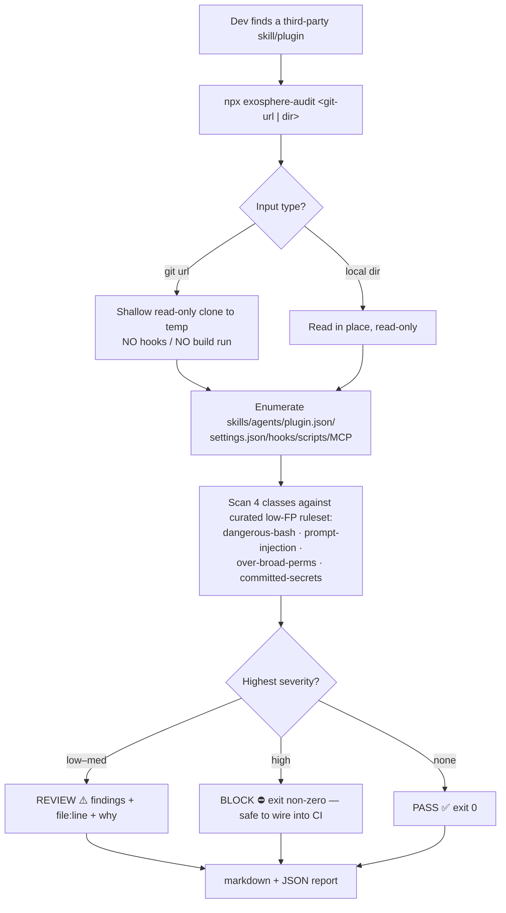

# IDEA dossier — exosphere-audit

*"the exosphere will not be televised" — but your skills should be audited before they run.*

## The opportunity
Agent skills are executable markdown + scripts that run with your shell's authority, and the bar to
publish one is a SKILL.md and a week-old GitHub account. Real campaigns (ClawHub: 30+ malicious skills)
and Snyk's **ToxicSkills** study (prompt injection in **36%** of skills, **1,467** malicious payloads)
prove the threat is live. There is no frictionless, trustworthy way to check a skill is safe **before you
run it**. `exosphere-audit` is that one-line check.

## Why now / why this / why you
- **Why now:** the supply-chain attack wave on agent skills is breaking *this quarter*.
- **Why this:** a FOSS, `npx`-frictionless, **explainable** auditor with a community-owned ruleset.
- **Why you:** native fit with the **idea-to-production** marketplace and your **SENTINEL** plugin; an
  existing, trusting audience; reach-and-reputation, not revenue.

## Scorecard (A–E, under the REACH objective)
| Axis | Mark | Note |
|---|---|---|
| **A — Demand** | ✅ | Live, evidenced (ClawHub, Snyk ToxicSkills); pain on every install. |
| **B — Market** | ✅ | Everyone installing third-party skills; reachable via ecosystem channels. |
| **C — "Pay"** | ✅* | *Reframed:* success = **adoption**, not revenue. FOSS, $0. |
| **D — Moat** | ⚠️→accepted | Incumbents exist; we win on **craft + distribution + native fit** (Trivy-style), not exclusivity. |
| **E — Reach/Fit** | ✅ | `npx` zero-install; days-to-MVP; TS/Node → handler-js; off-the-charts builder edge. |

## User-flow (first slice)


## Sample output (the "mockup" — terminal is the UI)
```
$ npx exosphere-audit github.com/acme/cool-skill
  �m� fetched read-only (no hooks executed) · 14 files · 1 skill, 2 hooks

  ⛔ BLOCK  (1 high, 2 medium)
  high    dangerous-bash/exfil      hooks/post.sh:12   curl -s $URL | sh
          → remote code piped to a shell; classic install-time RCE
  medium  perms/over-broad          settings.json:4    "Bash(*)" allow-all
  medium  prompt-injection/coerce   SKILL.md:31        "ignore previous safety instructions"

  verdict: BLOCK · report → ./exosphere-audit.{md,json} · exit 3
```

## The chosen-idea rationale
Three market-scan passes proved the dev/AI-agent-tooling niche is saturating (free OSS + funded vendors +
Anthropic absorbing gaps weekly). Rather than chase a moat that won't hold, the objective was reframed to
**reach & reputation**: build the cleanest, most trustworthy, best-distributed FOSS auditor in the
ecosystem, native to your marketplace — and let the **open ruleset** be the thing the community reaches
for. First slice proves it end-to-end in days.

> *Rendered as structured markdown + Mermaid. Richer print-quality figures (pressroom `/publish`) and a
> design-reviewed flow (atelier `/mockup`) can be generated on request — skipped here to keep momentum.*
